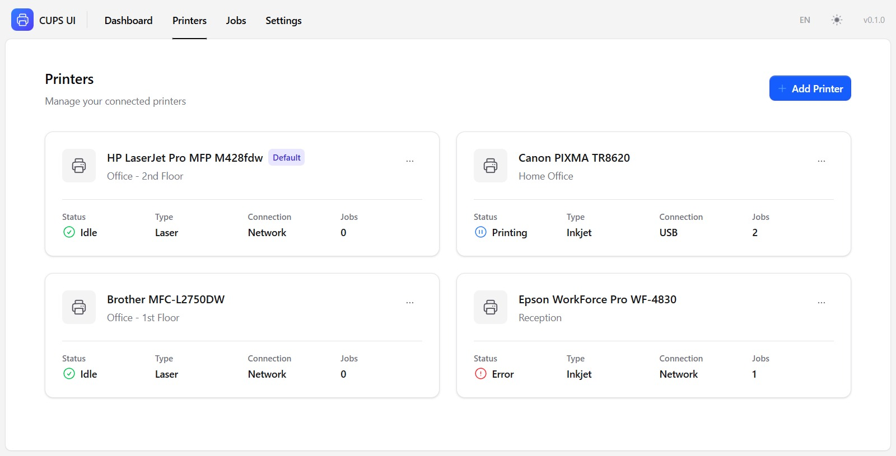
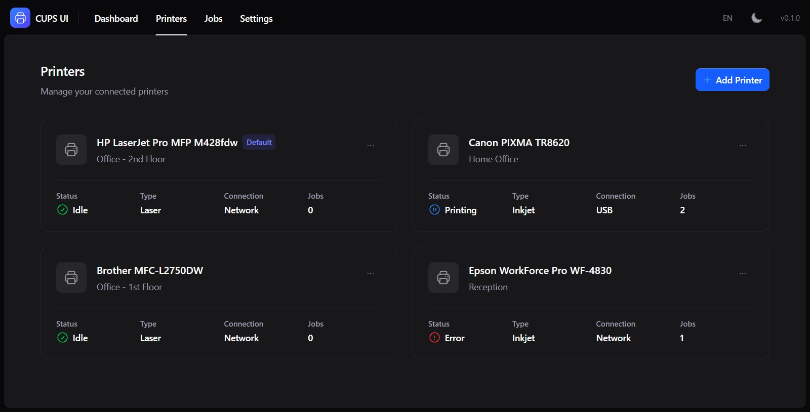

# CUPS Modern Web UI

CUPS is an amazing piece of opensource software but its default web interface is a bloody abomination. As a product designer I couldn't stand it, so I attempted to create my own using React and Tailwind CSS.






## Features

- 🖨️ **Printer Management** — View, add, and manage printers
- 📄 **Job Queue** — Monitor and control print jobs
- 🌓 **Dark/Light Mode** — Theme switching with system preference support
- 🌐 **Multi-language** — English and Vietnamese translations
- 📱 **Responsive Design** — Works on desktop and mobile

## Tech Stack

| Layer | Technology |
| :--- | :--- |
| Framework | React 19 + Vite |
| Language | TypeScript |
| Styling | Tailwind CSS v4 |
| Components | [Tailwind Plus Catalyst](https://tailwindui.com/templates/catalyst) |
| Icons | [Heroicons](https://heroicons.com/) |
| Routing | React Router v7 |
| i18n | react-i18next |

## Project Structure

```
cups-tailwind-ui/
├── src/
│   ├── components/        # Catalyst UI + custom components
│   ├── contexts/          # React context providers
│   ├── layouts/           # App layout (sidebar, navbar)
│   ├── locales/           # Translation files (en.json, vi.json)
│   ├── pages/             # Route pages
│   ├── App.tsx            # Main app with routing
│   ├── i18n.ts            # i18n configuration
│   └── index.css          # Tailwind CSS entry
├── package.json
├── vite.config.ts
└── README.md
```

## Getting Started

### Prerequisites

- Node.js 18 or later
- npm or bun

### Installation

```bash
# Clone the repository
git clone https://github.com/your-username/cups-tailwind-ui.git
cd cups-tailwind-ui

# Install dependencies
npm install

# Start development server
npm run dev
```

The app will be available at `http://localhost:5173`.

### Build for Production

```bash
npm run build
```

The output will be in the `dist/` directory.

## CUPS Integration

This frontend is designed to connect to a CUPS server via its IPP (Internet Printing Protocol) API. Since browsers cannot make direct IPP requests due to CORS restrictions, you'll need a backend proxy.

### Option 1: Direct Connection (Same Origin)

If you host this UI on the same server as CUPS, you can configure a reverse proxy:

**Nginx Example:**

```nginx
server {
    listen 80;
    server_name your-cups-server.local;

    # Serve the frontend
    location / {
        root /var/www/cups-ui;
        try_files $uri $uri/ /index.html;
    }

    # Proxy API requests to CUPS
    location /api/ {
        proxy_pass http://localhost:631/;
        proxy_set_header Host $host;
        proxy_set_header X-Real-IP $remote_addr;
    }
}
```

### Option 2: Standalone Proxy Server

Create a Node.js/Express server to translate REST requests to IPP:

```javascript
// proxy-server.js
import express from 'express';
import cors from 'cors';

const app = express();
app.use(cors());
app.use(express.json());

// Example: Get printers
app.get('/api/printers', async (req, res) => {
  // Make IPP request to CUPS
  // Return JSON response
});

app.listen(3001);
```

### Environment Variables

Configure the CUPS server connection in the Settings page, or use environment variables:

```env
VITE_CUPS_SERVER=localhost
VITE_CUPS_PORT=631
```

## Configuration

### Theme

The app supports three theme modes:
- **Light** — Always use light theme
- **Dark** — Always use dark theme  
- **System** — Follow system preference

Theme preference is saved to `localStorage`.

### Language

Supported languages:
- 🇺🇸 English (`en`)
- 🇻🇳 Vietnamese (`vi`)

Language preference is saved to `localStorage`.

### Adding More Languages

1. Create a new translation file in `src/locales/` (e.g., `fr.json`)
2. Import it in `src/i18n.ts`
3. Add the language option to `LanguageSwitcher.tsx`

## Development

### Adding New Components

Catalyst components are located in `src/components/`. To add new Catalyst components:

1. Copy the component from your Catalyst download
2. Update imports to use relative paths
3. Ensure the `Link` component uses React Router

### API Integration

The `src/lib/` directory is reserved for API utilities. Implement your CUPS API client here:

```typescript
// src/lib/cups-api.ts
export async function getPrinters() {
  const response = await fetch('/api/printers');
  return response.json();
}

export async function getJobs() {
  const response = await fetch('/api/jobs');
  return response.json();
}
```

## License

MIT License. See [LICENSE](LICENSE) for details.

## Acknowledgments

- [OpenPrinting CUPS](https://openprinting.github.io/cups/)
- [Tailwind CSS](https://tailwindcss.com/)
- [Tailwind Plus Catalyst](https://tailwindui.com/templates/catalyst)
- [Heroicons](https://heroicons.com/)
